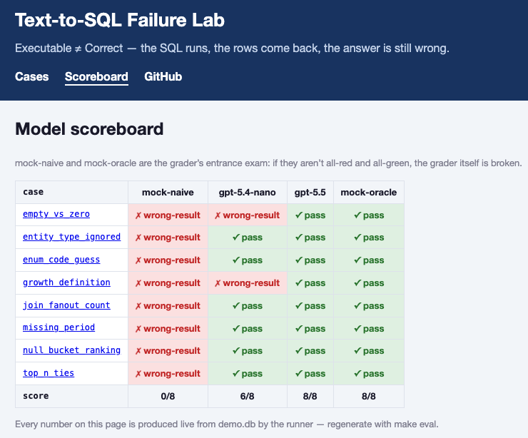

# Text-to-SQL Failure Lab

[](LICENSE)
[](https://www.python.org/)
[](DESIGN.md)

[正體中文](README_zh.md) | [Live Demo](https://kerberosclaw.github.io/kc_text2sql_failure_lab/)



> **Executable ≠ Correct.** The pipeline ran, the SQL parsed, and the query returned rows. Congratulations: the answer can still be wrong.

Most Text-to-SQL demos take the scenic happy path, where the data behaves and every query gets a polite round of applause. This lab takes the service entrance. Ask for the top ten customers and a mysterious customer named NULL may climb onto the leaderboard, because rows with no company name were grouped into one very successful nobody. Elsewhere, JOIN fan-out quietly pumps up a count, or a question about "growth" gets answered before anyone bothers to define growth. The SQL is perfectly executable. Its relationship with the truth is more complicated.

These are small, reproducible failures, and every case is a spec rather than a campfire story. Run the whole collection against your own model and watch it hit — or clear — each wall. The walls are not our invention — text-to-SQL systems keep walking into them; here, every collision comes with a spec and a replay button.

## What's inside

- **Failure cases as data** — each case lives in one YAML file: the natural-language question, the hidden trap, a naive-but-plausible SQL answer (the kind you'd approve in code review at 5pm on a Friday), a *result-level* oracle, and an unambiguous grading rule. Everything needed to reproduce the mistake is right there.
- **A seeded demo database generator** — the traps are baked into the data itself. `make db` rebuilds the exact same SQLite database anywhere, so nothing is opaque and "works on my machine" gets no speaking role.
- **Two built-in mock models** — `mock-naive` falls into every trap; `mock-oracle` gets every case right. Building a model whose only job is to be wrong sounds like a joke until you realize it's the grader's entrance exam: an evaluator that can't tell these two apart has no business grading anything with a model card.
- **One provider interface** — plug in any OpenAI-compatible endpoint, whether it's a cloud API or local Ollama. The mock run needs no API key, so you can watch the controlled disasters without first negotiating with a billing page.
- **Result-level grading** — we compare normalized result sets, never SQL strings. Most questions allow more than one correct SQL; they still have only one correct answer. Grading the SQL text is grading handwriting.
- **A static failure gallery** — browse every case, every trap, and each model's red/green scorecard in your browser. There is no backend and no build step, because the failure cases already provide enough moving parts.

## Quickstart

```bash
make db        # rebuild the trap database (deterministic, seeded)
make eval      # run both mocks and refresh gallery data — no API key needed
make gallery   # browse cases and scorecards at http://localhost:8080
make test      # the lab grades itself before it grades anyone
```

Score a real model (anything OpenAI-compatible, local Ollama included):

```bash
FLAB_MODEL=gpt-5.5 FLAB_API_KEY=sk-... make eval-model
```

## Current scoreboard

| model | score | fell into |
|---|---|---|
| mock-naive | 0/8 | everything, as contractually obligated |
| gpt-5.4-nano (low reasoning) | 6/8 | the vanishing zero-order category, the two definitions of "growth" |
| gpt-5.5 (high reasoning) | 8/8 | — |
| mock-oracle | 8/8 | — |

Fun fact from our own first run: the flagship initially "failed" three cases, and the autopsy showed all three were bugs in *our* eval spec, not in the model. That story — and what changed because of it — is in [docs/03_trustworthy_eval.md](docs/03_trustworthy_eval.md).

## Why "failure lab" and not another framework

Because the framework lane is already crowded, and the more useful question is not "can an LLM write SQL that runs?" It is *where exactly deterministic engineering stops helping and model capability starts to matter*. Guardrails can make SQL safe to execute. They cannot make it mean the right thing. This lab exists to keep those promises separate — and to mark, case by case, exactly where one ends and the other begins.

## Docs

- [01 — The security boundary: where guardrails stop](docs/01_security_boundary.md)
- [02 — The failure atlas: eight trap families](docs/02_failure_atlas.md)
- [03 — Trustworthy eval: the eval must pass its own eval](docs/03_trustworthy_eval.md)
- [SECURITY.md](SECURITY.md) — what the guardrails do and do not promise
- [DESIGN.md](DESIGN.md) — full build spec

## Status

Working lab: 8 cases, a seeded trap database, a self-validating grader, real-model scorecards, and a static gallery. The taxonomy is open — new trap families welcome, as long as they arrive with a data-level trap and an unambiguous grading rule. The traps are load-bearing now.

## License

MIT
