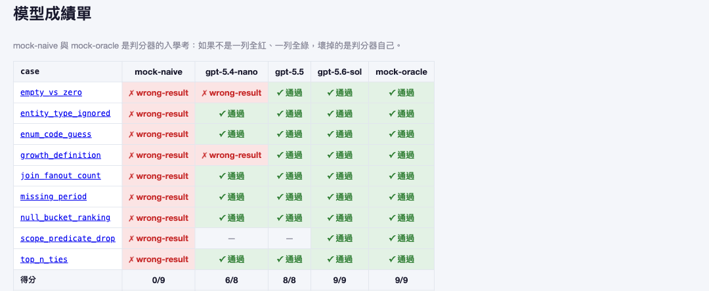

# Text-to-SQL 語意失敗實驗室

[](LICENSE)
[](https://www.python.org/)
[](DESIGN.md)

[English](README.md) | [線上展廊](https://kerberosclaw.github.io/kc_text2sql_failure_lab/)



> **跑得動，不等於是對的。** 系統正常運作、SQL 語法正確、查詢也真的回傳了資料。恭喜，答案照樣可以錯得很完整。

大多數 Text-to-SQL 示範只走光線明亮的快樂路線：資料很配合，查詢一出手，掌聲就自己響起來。這個實驗室偏要繞去後巷。你問「前十大客戶是誰」，排行榜上卻冒出一位名叫 NULL 的神祕大戶；其實只是散客的公司欄位都是空值，被 `GROUP BY` 熱情地湊成同一位。別的案例還有 JOIN 展開默默替計數灌水，以及連「成長」都沒定義，就已經很有自信地算出誰成長最多。SQL 全都跑得動，只是跟事實不太熟。

這些失敗案例都小巧、可重現，而且每一個都是規格，不是喝完第三杯才想起來的傳說。把自己的模型丟進去重跑一遍，就能看到它撞上哪些牆、閃過哪些牆。牆不是我們發明的 — Text-to-SQL 系統一直在撞；差別是在這裡，每一次碰撞都附規格書和重播鍵。

## 內容物

- **案例即資料** — 每個案例各住在一份 YAML 裡：自然語言問題、隱藏陷阱、看似合理的錯誤 SQL（就是你週五下午五點 code review 會放行的那種）、以「查詢結果」為準的標準答案（oracle），以及無歧義的判分規則。重現這個錯誤需要的東西，一樣不少。
- **可重建的示範資料庫生成器** — 陷阱直接埋在資料裡。無論在哪台機器執行 `make db`，都會重建出一模一樣的 SQLite；沒有黑箱，「可是在我電腦上可以」也沒有戲份。
- **兩顆內建模擬模型** — `mock-naive` 每個陷阱都踩，`mock-oracle` 每題都答對。特地做一顆「唯一工作就是答錯」的模型聽起來像在鬧，直到你發現這是判分器的入學考：連這兩顆都分不出來的評測器，沒資格幫任何真模型打分數。
- **單一供應介面** — 任何 OpenAI 相容端點都能接，雲端 API 與本地 Ollama 通吃。跑 mock 不需要 API key，不用先跟帳單培養感情，就能欣賞一場控制良好的翻車。
- **以結果判分、不比 SQL 字串** — 比對的是正規化後的結果集。多數問題可以有不只一種正確 SQL，但正確答案只有一個；走哪條路不重要，別把車開進田裡就好。
- **靜態失敗案例展廊** — 用瀏覽器就能逛完每個案例、每個陷阱，以及每顆模型的紅綠成績單。沒有後端，也沒有建置步驟；畢竟失敗案例本身已經夠忙了。

## 快速上手

```bash
make db        # 重建陷阱資料庫（固定 seed、確定性）
make eval      # 跑兩顆 mock 並更新展廊資料 — 不需要任何 API key
make gallery   # http://localhost:8080 逛案例與成績單
make test      # 實驗室先給自己打分，才輪得到別人
```

給真模型打分（任何 OpenAI 相容端點，含本地 Ollama）：

```bash
FLAB_MODEL=gpt-5.5 FLAB_API_KEY=sk-... make eval-model
```

不用端點、不用 key — 直接把你終端機在跑的 agent CLI 當模型打分：

```bash
FLAB_CLI_CMD="codex exec" FLAB_MODEL=codex make eval-cli   # 或 "claude -p"
```

## 目前成績單

| 模型 | 得分 | 踩了什麼 |
|---|---|---|
| mock-naive | 0/9 | 全部，依合約辦事 |
| gpt-5.4-nano（低推理） | 6/8 * | 消失的零訂單類別、「成長」的兩種定義 |
| gpt-5.5（高推理） | 8/8 * | — |
| gpt-5.6-sol（經 `codex`） | 9/9 | — |
| mock-oracle | 9/9 | — |

\* `gpt-5.4-nano` / `gpt-5.5` 兩個雲端跑分是在原本的八個家族上量的；第九個（`scope_predicate_drop`）是後加的，尚未對它們重跑。`gpt-5.6-sol` 是經本地 agent CLI（`codex exec`、不需 API key）對全部九案的一次全新跑分 — 用 `make eval-cli` 可重現。它正確地把高價值謂詞推導了出來（`HAVING SUM(數量 × 單價) > 500`）而非丟掉，這正是第九家族要暴露的強弱分野。

我們自己首跑的趣聞：旗艦模型一開始「掛」了三題，驗屍發現三題全是**我們評測規格的洞**、不是模型的錯。那個故事和它帶來的修正，寫在 [docs/03_trustworthy_eval.md](docs/03_trustworthy_eval.md)。

## 為什麼做「失敗實驗室」而不是又一個框架

因為框架那條賽道已經擠得像下班尖峰，而且真正值得問的不是「LLM 能不能寫出跑得動的 SQL」，而是**確定性工程到哪裡為止、模型能力從哪裡開始**。護欄可以讓 SQL 安全執行，卻沒辦法逼它表達正確的意思。這兩件事看起來很像，這個實驗室的工作就是把它們分開 — 一個案例一個案例，標出前者到哪裡為止、後者從哪裡開始。

## 文件

- [01 — 安全邊界：護欄到哪裡為止](docs/01_security_boundary.md)
- [02 — 失敗圖鑑：九個陷阱家族](docs/02_failure_atlas.md)
- [03 — 可信評測：評測要先考過自己](docs/03_trustworthy_eval.md)
- [SECURITY.md](SECURITY.md) — 護欄承諾什麼、不承諾什麼
- [DESIGN.md](DESIGN.md) — 完整設計

## 狀態

可運作的實驗室：9 個案例、埋好陷阱的種子資料庫、會自我驗證的判分器、真模型成績單、靜態展廊。分類學開放擴充，歡迎自帶資料層陷阱與無歧義判分規則的新家族。陷阱現在負責承重了。

## 授權

MIT
